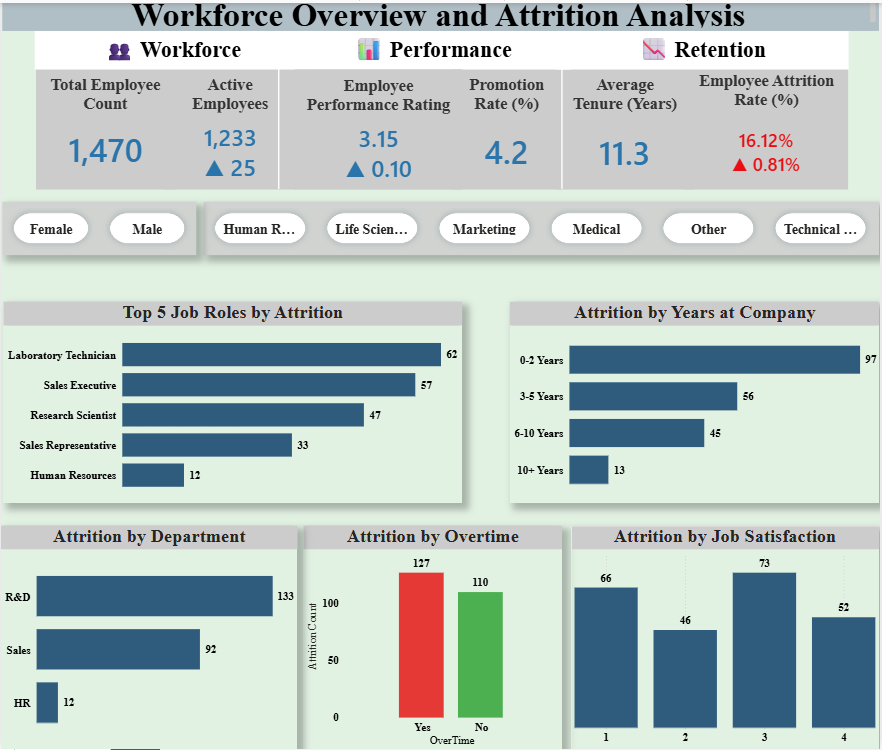
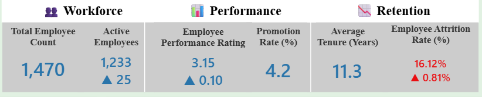
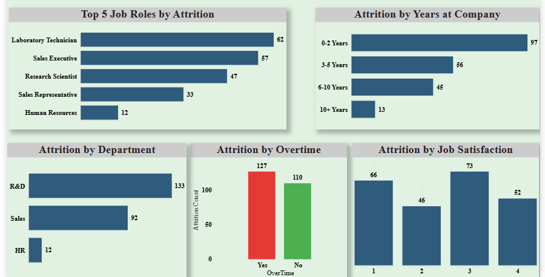
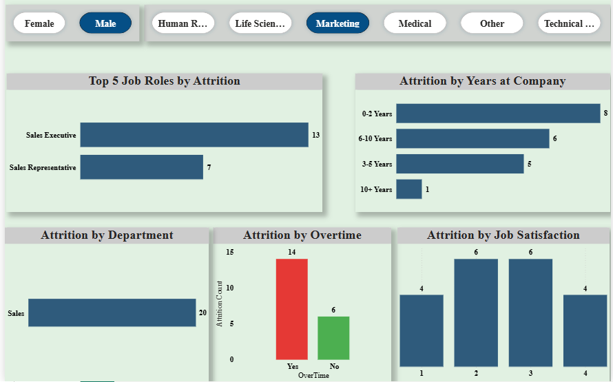

# Workforce Overview & Attrition Analysis (Power BI)

## Project Overview
Developed an interactive HR analytics dashboard to analyze employee attrition, workforce trends, and key HR KPIs.

## Objectives
- Analyze attrition rate across departments and job roles
- Identify high-risk employee segments
- Provide actionable insights for retention strategies

## Tools Used
- Power BI
- DAX
- Power Query

##  Key Insights
- 40% higher attrition among employees with 0–2 years tenure
- Higher churn observed in employees working overtime
- Certain departments showed consistently higher attrition trends

## 📷 Dashboard Preview

### 🔹 Dashboard Overview
Provides a complete view of workforce metrics, KPIs, and attrition trends.  

### 🔹 KPI Metrics
Displays key workforce KPIs such as employee count, attrition rate, and average tenure.  

### 🔹 Attrition Analysis
Breakdown of attrition by department, tenure, job roles, overtime, and satisfaction levels.  

### 🔹 Filters & Interactivity
Demonstrates interactive filtering of data by gender and department for deeper insights.  

##  Business Impact
Enabled HR teams to monitor workforce metrics and take data-driven decisions to improve retention.

##  Files Included
- Power BI Dashboard (.pbix)
- Dataset (if available)
- Screenshots
